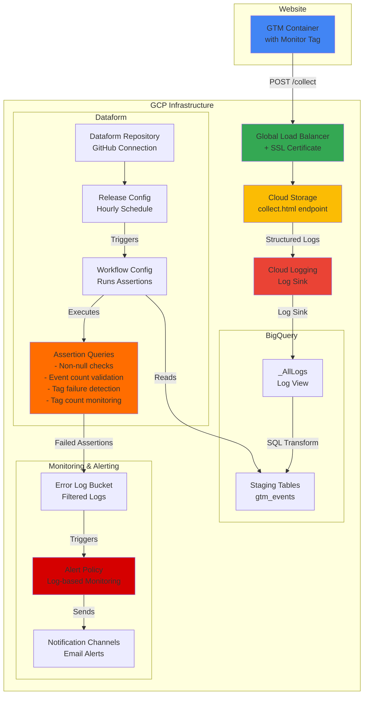

# GTM Tag Monitoring on GCP

A comprehensive solution for monitoring Google Tag Manager (GTM) tag firing with automated alerting using Google Cloud Platform, Terraform, and Dataform.

## Overview

This project provides an end-to-end infrastructure for monitoring GTM tag execution, storing event data in BigQuery, running automated assertions on the data, and sending alerts when issues are detected. The system captures GTM tag firing events from your website and validates them against configurable thresholds and conditions.

## Architecture



## Components

### 1. GTM Monitor Tag
- Custom GTM tag template that captures tag firing events
- Sends POST requests to the GCP endpoint with event metadata
- Tracks tag success/failure status and custom parameters
- Batching support for high-traffic websites

### 2. Infrastructure (Terraform)
- **Load Balancer**: Global HTTPS load balancer with custom domain support
- **Cloud Storage**: Serves a minimal HTML endpoint that receives GTM events
- **Cloud Logging**: Captures and structures incoming requests as logs
- **BigQuery**: Log view for querying structured event data
- **Dataform**: Automated SQL transformations and data quality assertions
- **Cloud Monitoring**: Alert policies and notification channels

### 3. Data Pipeline (Dataform)
- **Source Layer** (`00_sources`): Declares the BigQuery log view as a source
- **Staging Layer** (`01_staging`): Transforms raw logs into structured event tables
- **Assertion Layer** (`02_assertions`): Runs data quality checks with configurable thresholds

## Features

### Monitoring Capabilities
- ✅ **Tag Success/Failure Tracking**: Monitor which tags fired successfully or failed
- ✅ **Event Parameter Validation**: Ensure required parameters are present and non-null
- ✅ **Event Volume Monitoring**: Alert on abnormally low event counts
- ✅ **Tag Volume Monitoring**: Alert when specific tags fire below expected thresholds
- ✅ **Custom Threshold Configuration**: Set different thresholds per event, parameter, or tag
- ✅ **Time-based Exclusions**: Skip monitoring during specified time ranges (e.g., overnight)

### Assertion Types

#### 1. Non-Null Assertion
Validates that critical event parameters are not null or missing.

```javascript
non_null: {
    enabled: true,
    time_interval: '15 minute',
    threshold: 5,  // allow up to 5 null values before failing
    fields: [
        { name: 'transaction_id', threshold: 5 },
        { name: 'sku', threshold: 5 },
        { name: 'purchase_value', threshold: 5 }
    ]
}
```

#### 2. Low Event Count Assertion
Ensures minimum event volumes are maintained within specified time intervals.

```javascript
low_event_count: {
    enabled: true,
    time_interval: '1 hour',
    timezone: 'Europe/Berlin',
    exclude_time_ranges: [
        { start_time: '23:00:00', end_time: '08:00:00' }
    ],
    thresholds: [
        { event_name: 'place-order', min_count: 1 }
    ]
}
```

#### 3. Tag Failure Assertion
Detects when tags fail to fire successfully.

```javascript
tag_failure: {
    enabled: true,
    time_interval: '15 minute',
    threshold: 2,  // allow up to 2 failures before alerting
    exclude_tag_ids: ['68', '563', '208']  // exclude specific tags
}
```

#### 4. Low Tag Count Assertion
Monitors that specific tags fire at expected volumes.

```javascript
low_tag_count: {
    enabled: true,
    time_interval: '1 hour',
    timezone: 'Europe/Berlin',
    exclude_time_ranges: [
        { start_time: '23:00:00', end_time: '08:00:00' }
    ],
    thresholds: [
        { 
            tag_id: '529', 
            min_count: 1,
            status_filter: 'success',
            description: 'GA4 - purchase'
        }
    ]
}
```

## Prerequisites

- Google Cloud Platform account with billing enabled
- GitHub account (for Dataform repository connection)
- Domain name for the collection endpoint
- Basic knowledge of Terraform and GTM

### Required Tools
- [Google Cloud CLI (gcloud)](https://cloud.google.com/sdk/docs/install)
- [Terraform CLI](https://developer.hashicorp.com/terraform/downloads)
- Git

## Setup Instructions

### 1. GCP Project Setup

Create a new GCP project with billing enabled and note the project ID.

```bash
gcloud projects create YOUR_PROJECT_ID
gcloud billing projects link YOUR_PROJECT_ID --billing-account=YOUR_BILLING_ACCOUNT_ID
```

### 2. Repository Setup

Use this repository as a GitHub template, or clone it directly:

```bash
git clone https://github.com/YOUR_USERNAME/gtm-tag-monitoring-gcp.git
cd gtm-tag-monitoring-gcp
```

**For private repositories**: Create a [GitHub Personal Access Token](https://github.com/settings/tokens) with `repo` scope.

### 3. Configure Variables

Rename the example variables file:

```bash
cd terraform
cp terraform.tfvars.example terraform.tfvars
```

Edit `terraform.tfvars` with your configuration:

```hcl
project_id                         = "your-project-id"
region                             = "us-central1"
domain                             = "gtm-collect.yourdomain.com"
resource_prefix                    = "gtm-monitor"
endpoint                           = "/collect"

# GitHub configuration for Dataform
github_token                       = "ghp_xxxxxxxxxxxx"
github_username                    = "your-github-username"
github_repository                  = "gtm-tag-monitoring-gcp"
github_default_branch              = "main"

# Notification configuration
notification_users = [
  {
    name  = "Analytics Team"
    email = "analytics@yourdomain.com"
  }
]

# Log filtering (adjust based on your setup)
error_log_filter                   = "protoPayload.metadata.jobChange.job.jobStatus.state=\"DONE\" AND protoPayload.metadata.jobChange.job.jobStatus.errorResult.reason=\"stopped\" AND resource.labels.project_id=\"your-project-id\""

# Retention settings
error_log_bucket_retention_period  = 30
log_retention_days                 = 30

# Dataform scheduling
dataform_release_cron              = "0 */1 * * *"  # Every hour
dataform_workflow_cron             = "0 */1 * * *"  # Every hour
dataform_timezone                  = "Europe/Amsterdam"
```

### 4. Configure Dataform Settings

Edit `workflow_settings.yaml`:

```yaml
defaultProject: your-project-id
defaultLocation: US
defaultDataset: tag_monitoring
defaultAssertionDataset: assertions
```

### 5. Authenticate and Initialize

```bash
# Authenticate with GCP
gcloud auth application-default login

# Set the active project
gcloud config set project YOUR_PROJECT_ID

# Initialize Terraform
terraform init
```

### 6. Deploy Infrastructure

```bash
# Preview the changes
terraform plan

# Apply the infrastructure
terraform apply

# Migrate state to remote backend (created during apply)
terraform init -migrate-state
```

**Important**: After the first `terraform apply`, the remote backend (GCS bucket) is created. Running `terraform init -migrate-state` moves your state file to this remote backend for better collaboration and safety.

### 7. DNS Configuration

After deployment, Terraform outputs the load balancer IP address. Create an A record in your DNS settings:

```
Record Type: A
Name: gtm-collect (or your chosen subdomain)
Value: [IP address from terraform output]
TTL: 300
```

Wait for DNS propagation (can take up to 48 hours, typically much faster).

### 8. GTM Configuration

1. Import `Google Tag Manager Monitor - Enhanced.tpl` to your web GTM container:
   - In GTM, go to **Templates** → **Tag Templates** → **New**
   - Click the menu (⋮) → **Import**
   - Select the `.tpl` file from this repository

2. Create a new tag using the imported template

3. Configure the monitoring tag:
   - **Endpoint**: `https://gtm-collect.yourdomain.com/collect`
   - **Event Name**: Use a variable like `{{Event}}` to capture the triggering event
   - **Batch Hits**: Enable for high-traffic sites (recommended)
   - **Max Tags per Request**: 10-20 (adjust based on your needs)
   - **Additional Parameters**: Define custom event parameters to track

4. Set the trigger to fire on **All Events** or **All Custom Events**

5. **Important**: In Advanced Settings → Tag Sequencing → Firing Triggers:
   - Add `exclude=true` to the GTM Monitor tag itself to prevent self-tracking

6. Publish the container

### 9. Configure Dataform Assertions

1. Open the Dataform repository in the GCP Console
2. Create a new workspace
3. Edit `includes/config.js` to configure your assertions:

```javascript
const EVENT_PARAMS_ARRAY = [
    { name: 'value', alias: 'purchase_value' },
    { name: 't_id', alias: 'transaction_id' },
    { name: 'consent' },
    { name: 'sku' },
    { name: 'path' }
];

const ASSERTIONS = {
    non_null: {
        enabled: true,
        time_interval: '15 minute',
        threshold: 5,
        fields: [
            { name: 'transaction_id', threshold: 5 },
            { name: 'sku', threshold: 5 },
            { name: 'purchase_value', threshold: 5 }
        ]
    },
    low_event_count: {
        enabled: true,
        time_interval: '1 hour',
        timezone: 'Europe/Berlin',
        exclude_time_ranges: [
            { start_time: '23:00:00', end_time: '08:00:00' }
        ],
        thresholds: [
            { event_name: 'place-order', min_count: 1 }
        ]
    },
    tag_failure: {
        enabled: true,
        time_interval: '15 minute',
        threshold: 2,
        exclude_tag_ids: ['68', '563', '208']
    },
    low_tag_count: {
        enabled: true,
        time_interval: '1 hour',
        timezone: 'Europe/Berlin',
        exclude_time_ranges: [
            { start_time: '23:00:00', end_time: '08:00:00' }
        ],
        thresholds: [
            { tag_id: '529', min_count: 1, status_filter: 'success', description: 'GA4 - purchase' },
            { tag_id: '170', min_count: 1, status_filter: 'success', description: 'Floodlight - Sales' },
            { tag_id: '68', min_count: 1, status_filter: 'success', description: 'GAds - Conversion' }
        ]
    }
};

module.exports = {
    EVENT_PARAMS_ARRAY,
    ASSERTIONS
};
```

4. Commit and push your changes to trigger the Dataform workflow

### 10. Optional: Add Slack Notifications

You can manually add Slack as a notification channel in GCP:

1. Go to **Monitoring** → **Alerting** → **Edit Notification Channels**
2. Add **Slack** and authenticate with your workspace
3. Edit the alert policy to include the Slack channel

## Cost Considerations

### Monthly Cost Breakdown

1. **Cloud Storage**: ~$0.02/month (minimal - only 2 small files)
2. **BigQuery**:
   - Query processing: $5-6/TB processed
   - Storage: $0.02/GB/month for active storage
   - Typical monthly cost: $1-5 depending on traffic volume
3. **Cloud Logging**:
   - First 50 GB/month: Free
   - Additional data: $0.50/GB
   - Typical monthly cost: $0-2 for most sites
4. **Load Balancer**:
   - Global forwarding rule: ~$18/month (fixed cost)
   - Data processing: $0.008-0.012/GB
   - Typical monthly cost: $20-25
5. **Cloud Monitoring**: Usually free within GCP free tier limits
6. **Dataform**: Free (part of BigQuery)

**Estimated Total**: $25-35/month for typical implementations

**Note**: The load balancer forwarding rule is the primary fixed cost. All other costs scale with usage.

## Testing

### Verify the Setup

1. **Test the endpoint**:
   ```bash
   curl -I https://gtm-collect.yourdomain.com/collect
   # Should return 200 OK
   ```

2. **Check logs in BigQuery**:
   ```sql
   select *
   from `your-project-id.tag_monitoring_log_link._AllLogs`
   where timestamp > timestamp_sub(current_timestamp(), interval 1 hour)
   limit 10;
   ```

3. **Monitor Dataform executions**:
   - Go to **Dataform** in GCP Console
   - Check **Workflow Executions** for successful runs
   - Review **Assertion Results** for any failures

4. **Test alerting**:
   - Temporarily break a tag in GTM to trigger failures
   - Wait for the next Dataform workflow execution
   - Verify that email alerts are received

## Maintenance

### Updating Assertions

1. Modify `includes/config.js` in your Dataform workspace
2. Commit changes to GitHub
3. Wait for the next scheduled release/workflow execution
4. Verify changes in the Dataform console

### Viewing Historical Data

Query the staging table for historical tag performance:

```sql
select 
    event_name,
    tag_id,
    tag_status,
    count(*) as event_count,
    timestamp_trunc(event_timestamp, hour) as hour
from `your-project-id.tag_monitoring.gtm_events`
where date(event_timestamp) = current_date()
group by 1, 2, 3, 5
order by 5 desc;
```

### Monitoring Costs

```bash
# View BigQuery costs
gcloud billing accounts list
gcloud billing projects describe YOUR_PROJECT_ID

# Check BigQuery usage
bq show --format=prettyjson YOUR_PROJECT_ID:tag_monitoring
```

## Troubleshooting

### Issue: No data appearing in BigQuery

**Possible causes**:
1. DNS not propagated - wait up to 48 hours or check with `nslookup gtm-collect.yourdomain.com`
2. GTM tag not firing - verify in GTM Preview mode
3. Incorrect endpoint URL in GTM configuration
4. Log sink not configured properly - check Cloud Logging filters

**Solution**: Check Cloud Logging for incoming requests at `/collect` endpoint

### Issue: Assertions not running

**Possible causes**:
1. Dataform workflow not scheduled correctly
2. Service account permissions missing
3. GitHub connection failed

**Solution**:
- Check Dataform workflow executions in GCP Console
- Verify service account has BigQuery Data Editor and Job User roles
- Test GitHub connection in Dataform repository settings

### Issue: No alerts received

**Possible causes**:
1. Notification channel not configured
2. Alert policy filter incorrect
3. No assertion failures (good news!)

**Solution**:
- Verify email addresses in notification channels
- Check alert policy in Cloud Monitoring console
- Manually trigger a test by running a query that matches the error filter

### Issue: High costs

**Possible causes**:
1. Too many log entries being created
2. Inefficient BigQuery queries
3. High traffic volume

**Solutions**:
- Implement sampling in GTM (fire monitoring tag on a percentage of sessions)
- Optimize assertion queries to use partition filters
- Adjust log retention periods in `terraform.tfvars`
- Consider using table partitioning and clustering in BigQuery

## Destroying the Infrastructure

### Option 1: Delete the Entire Project

The simplest approach - deletes everything including all resources:

```bash
gcloud projects delete YOUR_PROJECT_ID
```

### Option 2: Terraform Destroy

To remove only Terraform-managed resources:

```bash
# Remove remote backend configuration
rm terraform/backend.tf

# Migrate state back to local
terraform init -migrate-state

# Delete all Dataform workspaces manually in GCP Console first

# Destroy infrastructure
terraform destroy
```

**Important**: Delete Dataform workspaces manually before running `terraform destroy` to avoid dependency issues.

## Project Structure

```
gtm-tag-monitoring-gcp/
├── definitions/                  # Dataform SQL definitions
│   ├── 00_sources/              # Source declarations
│   │   └── declarations.js      # BigQuery log view source
│   ├── 01_staging/              # Data transformation layer
│   │   └── gtm_events.sqlx      # Parse and structure GTM events
│   └── 02_assertions/           # Data quality checks
│       ├── non_null.sqlx        # Validate required parameters
│       ├── low_event_count.sqlx # Monitor event volumes
│       ├── tag_failure.sqlx     # Detect tag failures
│       └── low_tag_count.sqlx   # Monitor tag firing rates
├── includes/                     # Dataform configuration files
│   ├── config.js                # Assertion configuration
│   └── helpers.js               # Shared utility functions
├── terraform/                    # Infrastructure as Code
│   ├── alerting.tf              # Alert policies and notifications
│   ├── apis.tf                  # Enable required GCP APIs
│   ├── dataform.tf              # Dataform repository setup
│   ├── load_balancer.tf         # HTTPS load balancer config
│   ├── locals.tf                # Local variables
│   ├── logging.tf               # Log sinks and buckets
│   ├── outputs.tf               # Terraform outputs
│   ├── providers.tf             # Provider configuration
│   ├── remote_backend.tf        # GCS backend for state
│   ├── storage.tf               # Cloud Storage bucket
│   ├── variables.tf             # Variable declarations
│   └── terraform.tfvars.example # Example configuration
├── Google Tag Manager Monitor - Enhanced.tpl  # GTM tag template
├── workflow_settings.yaml        # Dataform project settings
├── .gitignore
├── LICENSE
└── README.md
```

## Advanced Configuration

### Custom Event Parameters

Add custom parameters to track in `includes/config.js`:

```javascript
const EVENT_PARAMS_ARRAY = [
    { name: 'value', alias: 'purchase_value' },
    { name: 'currency' },
    { name: 'user_id', alias: 'uid' },
    { name: 'session_id' }
];
```

The `alias` field allows you to rename parameters in BigQuery for better readability.

### Assertion Time Intervals

Adjust the `time_interval` based on your traffic patterns:


- **High traffic sites**: Use shorter intervals (5-15 minutes) for faster detection
- **Low traffic sites**: Use longer intervals (1-4 hours) to avoid false positives
- **E-commerce sites**: Monitor critical conversion events every 15-30 minutes

### Time-based Exclusions

Configure exclusions for periods with expected low traffic:

```javascript
exclude_time_ranges: [
    { start_time: '23:00:00', end_time: '08:00:00' },  // Overnight
    { start_time: '01:00:00', end_time: '06:00:00' }   // Early morning
]
```

**Important**: If the `end_time` is 6:00 and `time_interval` is 1 hour, the assertion checks events from 5:00-6:00. Set your `end_time` accordingly.

### Multiple Notification Channels

Add multiple email recipients or different notification types:

```hcl
notification_users = [
  { name = "Analytics Team", email = "analytics@company.com" },
  { name = "Dev Team", email = "dev@company.com" },
  { name = "On-Call", email = "oncall@company.com" }
]
```

## Security Considerations

1. **GitHub Token**: Store as a secret, never commit to repository
2. **Service Accounts**: Follow principle of least privilege
3. **Domain Access**: Ensure only your domain can send to the collection endpoint (configure CORS if needed)
4. **Log Retention**: Set appropriate retention periods to comply with data privacy regulations
5. **PII Data**: Avoid sending personally identifiable information through GTM monitoring

## Performance Optimization

### BigQuery Optimization

1. **Partition tables** by date for better query performance:
   ```sql
   -- Add to your staging query
   partition by date(event_timestamp)
   cluster by event_name, tag_id
   ```

2. **Use materialized views** for frequently queried data
3. **Set expiration** on old partitions to reduce storage costs

### GTM Optimization

1. **Sampling**: Fire the monitoring tag on a percentage of sessions
   ```javascript
   // In GTM, create a trigger with condition:
   // Random Number < 10  (for 10% sampling)
   ```

2. **Batching**: Enable batch hits for high-traffic sites to reduce request volume

3. **Selective Monitoring**: Only monitor critical tags and events

## Contributing

Contributions are welcome! Please follow these guidelines:

1. Fork the repository
2. Create a feature branch (`git checkout -b feature/amazing-feature`)
3. Commit your changes (`git commit -m 'Add amazing feature'`)
4. Push to the branch (`git push origin feature/amazing-feature`)
5. Open a Pull Request

## License

This project is licensed under the MIT License - see the [LICENSE](LICENSE) file for details.

## Support

For issues, questions, or contributions:
- **Issues**: Open an issue on GitHub
- **Discussions**: Use GitHub Discussions for questions
- **Security**: Report security vulnerabilities privately

## Changelog

### Version 1.0.0 (Initial Release)
- ✅ Terraform infrastructure setup with remote state backend
- ✅ GTM monitoring tag template with batching support
- ✅ Dataform integration with GitHub
- ✅ Four assertion types (non-null, event count, tag failure, tag count)
- ✅ Automated alerting via Cloud Monitoring
- ✅ Email notification channels
- ✅ Configurable time-based exclusions
- ✅ Custom event parameter tracking

## Roadmap

- [ ] Slack notification support in Terraform
- [ ] Pre-built dashboard templates for Data Studio/Looker
- [ ] Advanced anomaly detection using statistical models
- [ ] Support for multiple GTM containers in a single project
- [ ] Cost optimization recommendations based on usage patterns
- [ ] Mobile app (GTM SDK) support

## Acknowledgments

Built with:
- [Terraform](https://www.terraform.io/) - Infrastructure as Code
- [Dataform](https://dataform.co/) - SQL data transformations
- [Google Cloud Platform](https://cloud.google.com/) - Cloud infrastructure
- [Google Tag Manager](https://tagmanager.google.com/) - Tag management system

---

**Note**: This is an infrastructure monitoring solution and does not guarantee 100% accuracy in tag tracking. Always validate critical business metrics through multiple sources.
